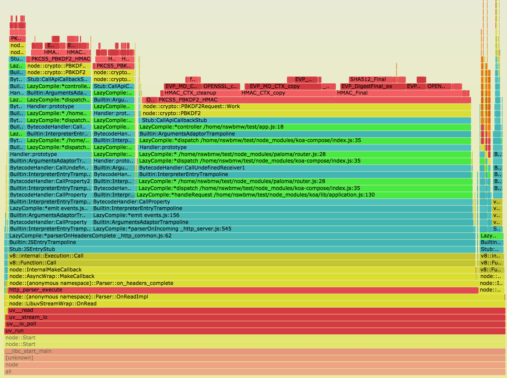

[火焰图](http://www.brendangregg.com/flamegraphs.html)（Flame Graph）想必大家都听过，它可以将 CPU 的使用情况可视化，使我们直观地了解到程序的性能瓶颈。我们通常要结合操作系统的性能分析工具（profiling tracer）使用火焰图，常见的操作系统的性能分析工具如下：

- Linux：perf, eBPF, SystemTap, and ktap。
- Solaris, illumos, FreeBSD：DTrace。
- Mac OS X：DTrace and Instruments。
- Windows：Xperf.exe。

## perf

[perf_events](http://www.brendangregg.com/linuxperf.html)（简称 perf）是 Linux Kernal 自带的系统性能分析工具，能够进行函数级与指令级的热点查找。它基于事件采样原理，以性能事件为基础，支持针对处理器相关性能指标与操作系统相关性能指标的性能剖析，常用于查找性能瓶颈及定位热点代码。

测试机器：

```sh
$ uname -a
Linux nswbmw-VirtualBox 4.10.0-28-generic #32~16.04.2-Ubuntu SMP Thu Jul 20 10:19:48 UTC 2017 x86_64 x86_64 x86_64 GNU/Linux
```

**注意**：非 Linux 用户需要用虚拟机安装 Ubuntu 16.04 和 node@8.9.4 后进行后面的操作。

安装 perf：

```sh
$ sudo apt install linux-tools-common
$ perf # 根据提示安装对应的内核版本的 tools, 如下
$ sudo apt install linux-tools-4.10.0-28-generic linux-cloud-tools-4.10.0-28-generic
```

创建测试目录 ~/test 和测试代码：

**app.js**

```js
const crypto = require('crypto')
const Paloma = require('paloma')
const app = new Paloma()
const users = {}

app.route({ method: 'GET', path: '/newUser', controller (ctx) {
  const username = ctx.query.username || 'test'
  const password = ctx.query.password || 'test'

  const salt = crypto.randomBytes(128).toString('base64')
  const hash = crypto.pbkdf2Sync(password, salt, 10000, 64, 'sha512').toString('hex')

  users[username] = { salt, hash }

  ctx.status = 204
}})

app.route({ method: 'GET', path: '/auth', controller (ctx) {
  const username = ctx.query.username || 'test'
  const password = ctx.query.password || 'test'

  if (!users[username]) {
    ctx.throw(400)
  }
  const hash = crypto.pbkdf2Sync(password, users[username].salt, 10000, 64, 'sha512').toString('hex')

  if (users[username].hash === hash) {
    ctx.status = 204
  } else {
    ctx.throw(403)
  }
}})
 
app.listen(3000)
```

添加 --perf_basic_prof（或者 --perf-basic-prof）参数运行此程序，会对应生成一个 /tmp/perf-\<PID\>.map 的文件。命令如下：

```sh
$ node --perf_basic_prof app.js &
[1] 3590
$ tail /tmp/perf-3590.map
51b87a7b93e 18 Function:~emitListeningNT net.js:1375
51b87a7b93e 18 LazyCompile:~emitListeningNT net.js:1375
51b87a7bad6 39 Function:~emitAfterScript async_hooks.js:443
51b87a7bad6 39 LazyCompile:~emitAfterScript async_hooks.js:443
51b87a7bcbe 77 Function:~tickDone internal/process/next_tick.js:88
51b87a7bcbe 77 LazyCompile:~tickDone internal/process/next_tick.js:88
51b87a7bf36 12 Function:~clear internal/process/next_tick.js:42
51b87a7bf36 12 LazyCompile:~clear internal/process/next_tick.js:42
51b87a7c126 b8 Function:~emitPendingUnhandledRejections internal/process/promises.js:86
51b87a7c126 b8 LazyCompile:~emitPendingUnhandledRejections internal/process/promises.js:86
```

**map 文件内容三列依次为**：16进制的符号地址（symbol addresses）、大小（sizes）和符号名（symbol names）。perf 会尝试查找 /tmp/perf-\<PID\>.map 文件，用来做符号转换，即把 16 进制的符号地址转换成人能读懂的符号名。

**注意**：使用 --perf_basic_prof_only_functions 参数也可以，但经尝试后发现生成的火焰图信息不全（不全的地方显示 [perf-\<PID\>.map]），所以这里使用 --perf_basic_prof。但是，使用 --perf_basic_prof  有个缺点，就是会导致 map 文件一直增大，这是由于符号（symbols）地址不断变换导致的，用 --perf_basic_prof_only_functions 可以缓解这个问题。关于如何取舍，还请读者自行尝试。

接下来 clone 用来生成火焰图的工具：

```sh
$ git clone http://github.com/brendangregg/FlameGraph ~/FlameGraph
```

我们先用 ab 压测：

```sh
$ curl "http://localhost:3000/newUser?username=admin&password=123456"
$ ab -k -c 10 -n 2000 "http://localhost:3000/auth?username=admin&password=123456"
```

新开另一个终端，在 ab 开始压测后立即运行：

```sh
$ sudo perf record -F 99 -p 3590 -g -- sleep 30
$ sudo chown root /tmp/perf-3590.map
$ sudo perf script > perf.stacks
$ ~/FlameGraph/stackcollapse-perf.pl --kernel < ~/perf.stacks | ~/FlameGraph/flamegraph.pl --color=js --hash> ~/flamegraph.svg
```

**注意**：第 1 次生成的 svg 可能不太准确，最好重复几次以上步骤，使用第 2 次及以后生成的 flamegraph.svg。

有几点需要解释一下：

- perf record
  - -F 指定了采样频率 99Hz（即每秒 99 次，如果 99 次都返回同一个函数名，那就说明 CPU 在这一秒钟都在执行同一个函数，可能存在性能问题）。
  - -p 指定进程的 pid。
  - -g 启用 call-graph 记录。
  - -- sleep 30 指定记录 30s。

- sudo chown root /tmp/perf-3009.map

  - 将 map 文件更改为 root 权限，否则会报如下错误：
  > File /tmp/perf-PID.map not owned by current user or root, ignoring it (use -f to override).
  > Failed to open /tmp/perf-PID.map, continuing without symbols

- perf record 会将记录的信息保存到当前执行目录的 perf.data 文件，使用 perf script 读取 perf.data 的 trace 信息写入 perf.stacks。

- --color=js 指定生成针对 js 配色的 svg，即：

  - green：JavaScript。
  - blue：Builtin。
  - yellow：C++。
  - red：System（native user-level, and kernel）。

ab 压测用了 30s 左右，浏览器打开 flamegraph.svg，截取关键的部分如下图所示：


## 理解火焰图

火焰图含义：

- 每一个小块代表了一个函数在栈中的位置（即一个栈帧）。
- Y 轴代表栈的深度（栈上的帧数），顶端的小块显示了占据 CPU 的函数。每个小块的下面是它的祖先（即父函数）。
- X 轴代表总的样例群体。它不像绝大多数图表那样从左到右表示时间的流逝，其左右顺序没有特殊含义，仅仅是按照字母表的顺序排列。
- 小块的宽度表示 CPU 的使用时间，或者说相对于父函数而言使用 CPU 的比率（基于所有样例），越宽则代表占用 CPU 的时间越长，或者使用 CPU 很频繁。
- 如果采取多线程并发运行取样，则取样数量会超过运行时间。

**从上图可以看出**：最上面的绿色小块（即 JavaScript 代码）指向 test/app.js 第 18 行，即 `GET /auth` 这个路由。再往上看，黄色的小块（即 C++ 代码） node::crypto::PBKDF2 占用了大量的 CPU 时间。

**解决方法**：将同步改为异步，即将 crypto.pbkdf2Sync 改为 crypto.pbkdf2，修改如下：

```js
app.route({ method: 'GET', path: '/auth', async controller (ctx) {
  const username = ctx.query.username || 'test'
  const password = ctx.query.password || 'test'

  if (!users[username]) {
    ctx.throw(400)
  }
  const hash = await new Promise((resolve, reject) => {
    crypto.pbkdf2(password, users[username].salt, 10000, 64, 'sha512', (err, derivedKey) => {
      if (err) {
        return reject(err)
      }
      resolve(derivedKey.toString('hex'))
    })
  })

  if (users[username].hash === hash) {
    ctx.status = 204
  } else {
    ctx.throw(403)
  }
}})
```

用 ab 重新压测，结果用了 16s。重新生成的火焰图如下：


**可以看出**：只有在左侧极窄的绿色小块可以看到 JavaScript 代码，红色的部分我们不关心也无法优化。那么，为什么异步比同步的 QPS 要高呢？原因是 Node.js 底层的 libuv 用了多个线程做计算任务，这里就不再深入介绍了。

svg 火焰图的其他小技巧如下：

1. 单击任意一个小块可以展开，即被单击的小块宽度变宽，它的子函数也按比例变宽，方便查看。
2. 可单击 svg 右上角的 search 按钮进行搜索，被搜索的关键词会高亮显示，在有目的查找某个函数时比较有用。

## 红蓝差分火焰图

虽然我们有了火焰图，但要处理性能回退问题，还需要在修改代码前后的火焰图之间，不断切换和对比，来找出问题所在，很不方便。于是 [Brendan D. Gregg](http://www.brendangregg.com/index.html) 又发明了红蓝差分火焰图（Red/Blue Differential Flame Graphs）。

**如下所示**：红色表示增长，蓝色表示衰减。


红蓝差分火焰图的工作原理如下：

1. 抓取修改前的栈 profile1 文件。
2. 抓取修改后的栈 profile2 文件。
3. 使用 profile2 来生成火焰图，这样栈帧的宽度就是以 profile2 文件为基准的。
4. 使用 2 - 1 的差异来对火焰图重新上色。上色的原则是：如果栈帧在 profile2 中出现出现的次数更多，则标为红色，否则标为蓝色。色彩是根据修改前后的差异来填充的。

这样，通过红蓝差分火焰图，我们就可以清楚地看到系统性能的差异之处。

生成红蓝差分火焰图的流程如下：

1. 修改代码前运行：

   ```sh
   $ sudo perf record -F 99 -p <PID> -g -- sleep 30
   $ sudo chown root /tmp/perf-<PID>.map
   $ sudo perf script > perf_before.stacks
   ```

2. 修改代码后运行：

   ```sh
   $ sudo perf record -F 99 -p <PID> -g -- sleep 30
   $ sudo chown root /tmp/perf-<PID>.map
   $ sudo perf script > perf_after.stacks
   ```

3. 将 profile 文件进行折叠（fold），然后生成差分火焰图：

   ```sh
   $ ~/FlameGraph/stackcollapse-perf.pl ~/perf_before.stacks > perf_before.folded
   $ ~/FlameGraph/stackcollapse-perf.pl ~/perf_after.stacks > perf_after.folded
   $ ./FlameGraph/difffolded.pl perf_before.folded perf_after.folded | ./FlameGraph/flamegraph.pl > flamegraph_diff.svg
   ```

**如上缺点是**：如果一个代码执行路径完全消失了，那么在火焰图中就找不到地方来标注蓝色，我们只能看到当前的 CPU 使用情况，却不知道为什么会变成这样。

一个解决办法是：生成一个相反的差分火焰图，即基于 profile1 生成 1 - 2 的差分火焰图。对应命令如下：

```sh
$ ./FlameGraph/difffolded.pl perf_after.folded perf_before.folded | ./FlameGraph/flamegraph.pl --negate > flamegraph_diff2.svg
```

其中，--negate 用于颠倒红/蓝配色。最终我们得到：

- flamegraph_diff.svg：宽度是以修改前的 profile 文件为基准，颜色表明将要发生的情况。
- flamegraph_diff2.svg：宽度是以修改后的 profile 文件为基准，颜色表明已经发生的情况。

总之，红蓝差分火焰图可能只在代码变化不大的情况下使用时效果明显，代码变化多了效果可能就不明显了。

## 参考链接

- https://yunong.io/2015/11/23/generating-node-js-flame-graphs/
- http://www.brendangregg.com/perf.html
- http://www.brendangregg.com/blog/2014-09-17/node-flame-graphs-on-linux.html
- https://linux.cn/article-4670-1.html
- http://www.brendangregg.com/blog/2014-11-09/differential-flame-graphs.html
- http://www.ruanyifeng.com/blog/2017/09/flame-graph.html

下一节：[1.2 v8-profiler](https://github.com/nswbmw/node-in-debugging/blob/master/1.2%20v8-profiler.md)
