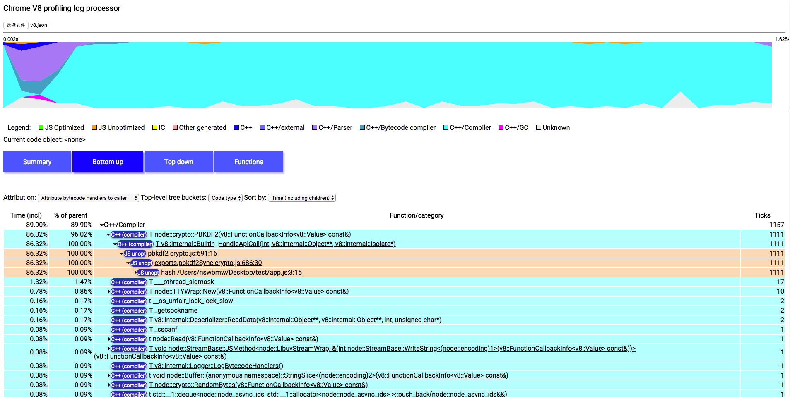

V8 有一个内置的性能分析工具，可以记录 JavaScript/C/C++ 代码的堆栈信息，该功能默认是关闭的，可以通过添加命令行参数 `--prof` 开启。

## 1.3.1 Tick Processor

创建测试代码：

**app.js**

```js
const crypto = require('crypto')

function hash (password) {
  const salt = crypto.randomBytes(128).toString('base64')
  const hash = crypto.pbkdf2Sync(password, salt, 10000, 64, 'sha512')
  return hash
}

console.time('pbkdf2Sync')
for (let i = 0; i < 100; i++) {
  hash('random_password')
}
console.timeEnd('pbkdf2Sync')
```

运行：

```sh
$ node --prof app
pbkdf2Sync: 1375.582ms
```

可以看出，执行 100 次 hash 函数总共用了 1375.585ms，并且当前目录下多了一个 isolate-xxx-v8.log 文件，该文件记录了 V8 的性能日志，内容如下：

```
v8-version,6,1,534,50,0
shared-library,"/usr/local/bin/node",0x100001800,0x100bbb69a,0
...
code-creation,Function,18,111912,0x37d07c7246a8,144,"hash /Users/nswbmw/Desktop/test/app.js:3:15",0x37d07c7076d0,~
code-creation,LazyCompile,18,111927,0x37d07c7246a8,144,"hash /Users/nswbmw/Desktop/test/app.js:3:15",0x37d07c7076d0,~
code-creation,Function,18,112058,0x37d07c725690,80,"exports.pbkdf2Sync crypto.js:686:30",0x37d07c70cb58,~
code-creation,LazyCompile,18,112074,0x37d07c725690,80,"exports.pbkdf2Sync crypto.js:686:30",0x37d07c70cb58,~
...
```

早期我们需要借助 [node-tick-processor](https://www.npmjs.com/package/node-tick-processor) 这样的工具解析 v8.log，但 Node.js 在 v5.2.0 之后包含了 v8.log 处理器，添加命令行参数 `--prof-process` 开启。

运行：

```sh
$ node --prof-process isolate-0x103000000-v8.log
```

结果如下：

```
Statistical profiling result from isolate-0x103000000-v8.log, (1152 ticks, 44 unaccounted, 0 excluded).

 [Shared libraries]:
   ticks  total  nonlib   name

 [JavaScript]:
   ticks  total  nonlib   name
      1    0.1%    0.1%  Function: ~Uint8Array native typedarray.js:158:31
      1    0.1%    0.1%  Function: ~NativeModule.cache bootstrap_node.js:604:42
      1    0.1%    0.1%  Function: ~Buffer.toString buffer.js:609:37

 [C++]:
   ticks  total  nonlib   name
   1023   88.8%   88.8%  T node::crypto::PBKDF2(v8::FunctionCallbackInfo<v8::Value> const&)
     27    2.3%    2.3%  t node::(anonymous namespace)::ContextifyScript::New(v8::FunctionCallbackInfo<v8::Value> const&)
     ...

 [Summary]:
   ticks  total  nonlib   name
      3    0.3%    0.3%  JavaScript
   1105   95.9%   95.9%  C++
      3    0.3%    0.3%  GC
      0    0.0%          Shared libraries
     44    3.8%          Unaccounted

 [C++ entry points]:
   ticks    cpp   total   name
   1062   98.2%   92.2%  T v8::internal::Builtin_HandleApiCall(int, v8::internal::Object**, v8::internal::Isolate*)
     13    1.2%    1.1%  T v8::internal::Runtime_CompileLazy(int, v8::internal::Object**, v8::internal::Isolate*)
     ...

 [Bottom up (heavy) profile]:
  Note: percentage shows a share of a particular caller in the total
  amount of its parent calls.
  Callers occupying less than 1.0% are not shown.

   ticks parent  name
   1023   88.8%  T node::crypto::PBKDF2(v8::FunctionCallbackInfo<v8::Value> const&)
   1023  100.0%    T v8::internal::Builtin_HandleApiCall(int, v8::internal::Object**, v8::internal::Isolate*)
   1023  100.0%      Function: ~pbkdf2 crypto.js:691:16
   1023  100.0%        Function: ~exports.pbkdf2Sync crypto.js:686:30
   1023  100.0%          Function: ~hash /Users/nswbmw/Desktop/test/app.js:3:15
   1023  100.0%            Function: ~<anonymous> /Users/nswbmw/Desktop/test/app.js:1:11
   ...
```

打印结果包含六部分：Shared libraries、JavaScript、C++、Summary、C++ entry points 和 Bottom up (heavy) profile。[JavaScript] 部分列出了 JavaScript 代码执行所占用的 CPU ticks（CPU 时钟周期），[C++] 部分列出了 C++ 代码执行所占用的 CPU ticks，[Summary] 列出了各个部分的占比，[Bottom up] 列出了所有 CPU 占用时间从大到小的函数及堆栈信息，小于 1% 的则不予显示。

**可以看出**：88.8%的 CPU 时间都花在了 crypto.js 文件的 pbkdf2Sync 函数上，该函数在 app.js 第 3 行被调用，即我们的 hash 函数。

**解决方法**：将同步的 pbkdf2Sync 改为异步的 pbkdf2。修改代码如下：

```js
const crypto = require('crypto')

function hash (password, cb) {
  const salt = crypto.randomBytes(128).toString('base64')
  const hash = crypto.pbkdf2(password, salt, 10000, 64, 'sha512', cb)
  return hash
}

console.time('pbkdf2')
for (let i = 0; i < 100; i++) {
  hash('random_password', (err, hash) => console.log(hash))
}
console.timeEnd('pbkdf2')
```

运行结果：

```sh
$ node --prof app
pbkdf2: 4.756ms
...
```

可以看出，程序运行了 4.756ms，相比较于之前的 1375.585ms，性能提升了 288 倍！我们继续看下 v8.log 的分析结果，运行：

```sh
$ node --prof-process isolate-0x102802400-v8.log
Statistical profiling result from isolate-0x102802400-v8.log, (200 ticks, 9 unaccounted, 0 excluded).

 [Shared libraries]:
   ticks  total  nonlib   name
      3    1.5%          /usr/lib/system/libsystem_malloc.dylib

 [JavaScript]:
   ticks  total  nonlib   name
      1    0.5%    0.5%  Stub: CallICStub
      1    0.5%    0.5%  StoreIC: A store IC from the snapshot
      1    0.5%    0.5%  Function: ~runInThisContext bootstrap_node.js:495:28
      1    0.5%    0.5%  Function: ~inspect buffer.js:649:70
      1    0.5%    0.5%  Function: ~hash /Users/nswbmw/Desktop/test/app.js:11:27
      1    0.5%    0.5%  Function: ~emitAfterScript async_hooks.js:443:25
      1    0.5%    0.5%  Function: ~<anonymous> async_hooks.js:1:11

 [C++]:
   ticks  total  nonlib   name
     91   45.5%   46.2%  T ___kdebug_trace_string
     25   12.5%   12.7%  t node::(anonymous namespace)::ContextifyScript::New(v8::FunctionCallbackInfo<v8::Value> const&)
     ...

 [Summary]:
   ticks  total  nonlib   name
      7    3.5%    3.6%  JavaScript
    181   90.5%   91.9%  C++
      3    1.5%    1.5%  GC
      3    1.5%          Shared libraries
      9    4.5%          Unaccounted

 [C++ entry points]:
   ticks    cpp   total   name
     39   63.9%   19.5%  T v8::internal::Builtin_HandleApiCall(int, v8::internal::Object**, v8::internal::Isolate*)
     16   26.2%    8.0%  T v8::internal::Runtime_CompileLazy(int, v8::internal::Object**, v8::internal::Isolate*)
     ...

 [Bottom up (heavy) profile]:
  Note: percentage shows a share of a particular caller in the total
  amount of its parent calls.
  Callers occupying less than 1.0% are not shown.

   ticks parent  name
     91   45.5%  T ___kdebug_trace_string
     ...
     25   12.5%  t node::(anonymous namespace)::ContextifyScript::New(v8::FunctionCallbackInfo<v8::Value> const&)
     ...
     17    8.5%  T ___pthread_sigmask
     ...
```

可以看出，[Bottom up] 没有很多 ticks，而且不再有 pbkdf2 这种堆栈信息。

## 1.3.2 Web UI

V8 还提供了一个 Web 可视化工具来查看生成的 v8 日志。首先，将代码还原到使用 pbkdf2Sync 的版本，运行：

```sh
$ node --prof app # 生成 isolate-0x103000000-v8.log
$ node --prof-process --preprocess isolate-0x103000000-v8.log > v8.json # 格式化成 JSON 文件
$ git clone https://github.com/v8/v8.git # 克隆 v8 仓库
$ open v8/tools/profview/index.html # 打开 V8 profiling log processor
```

点击 “选择文件”，选择刚才生成的 v8.json 文件，点击 “Bottom up” 视图，如下所示：



有以下两点需要解释：

1. 图中的上半部分展示了 CPU 的 timeline，X 轴代表时间的流逝，Y 轴代表当前时间点不同部分占用 CPU 的比例，可以在 timeline 图表上单击左键不放，然后拖动，选择时间区间。
2. 图中的下半部分展示了当前时间段内 CPU 占用比从大到小降序排列的函数，展开可查看堆栈信息。不同的颜色代表了不同的部分，点击任意一个函数，timeline 底部会展示该函数的执行时间分布。

## 1.3.3 参考链接

- https://github.com/v8/v8/wiki/V8-Profiler
- https://blog.ghaiklor.com/profiling-nodejs-applications-1609b77afe4e
- https://stackoverflow.com/questions/23934451/how-to-read-nodejs-internal-profiler-tick-processor-output

上一节：[1.2 v8-profiler](https://github.com/nswbmw/node-in-debugging/blob/master/1.2%20v8-profiler.md)

下一节：[2.1 gcore + llnode](https://github.com/nswbmw/node-in-debugging/blob/master/2.1%20gcore%20%2B%20llnode.md)
