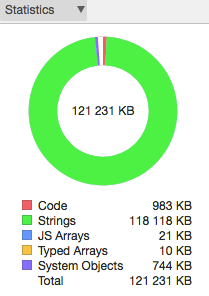
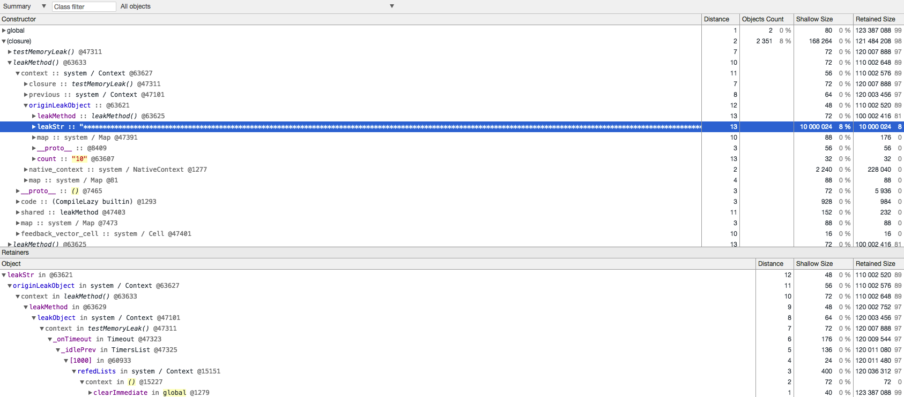
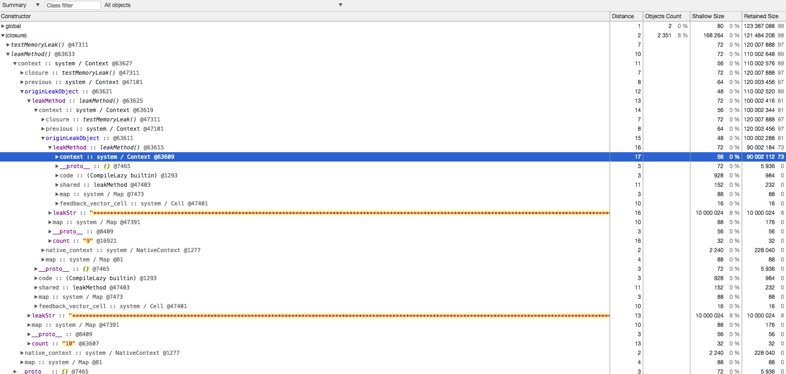

[heapdump](https://github.com/bnoordhuis/node-heapdump) 是一个 dump V8 堆信息的工具。[v8-profiler](https://github.com/node-inspector/v8-profiler) 也包含了此功能，这两个工具的原理都是一致的，都是 v8::Isolate::GetCurrent()->GetHeapProfiler()->TakeHeapSnapshot(title, control)。heapdump 的使用简单些，下面我们以 heapdump 为例讲解如何分析 Node.js 内存泄漏。

我们用一段经典的内存泄漏代码当作我们的测试代码，代码如下：

**app.js**

```js
const heapdump = require('heapdump')
let leakObject = null
let count = 0

setInterval(function testMemoryLeak() {
  const originLeakObject = leakObject
  const unused = function () {
    if (originLeakObject) {
      console.log('originLeakObject')
    }
  }
  leakObject = {
    count: String(count++),
    leakStr: new Array(1e7).join('*'),
    leakMethod: function () {
      console.log('leakMessage')
    }
  }
}, 1000)
```

为什么这段程序会发生内存泄漏呢？首先我们要明白闭包的原理：

**同一个函数内部的闭包作用域只有一个，所有闭包共享。在执行函数的时候，如果遇到闭包，会创建闭包作用域内存空间，将该闭包所用到的局部变量添加进去，然后再遇到闭包，会在之前创建好的作用域空间添加此闭包会用到而前闭包没用到的变量。函数结束，清除没有被闭包作用域引用的变量。**

**这段代码内存泄露原因是**：testMemoryLeak 函数内有两个闭包：unused 和 leakMethod。unused 这个闭包引用了父作用域中的 originLeakObject 变量，如果没有后面的 leakMethod，则会在函数结束后清除，闭包作用域也跟着清除了。因为后面的 leakObject 是全局变量，即 leakMethod 是全局变量，它引用的闭包作用域（包含了 unused 所引用的 originLeakObject）不会释放。而随着 testMemoryLeak 不断调用，originLeakObject 指向前一次的 leakObject，下次的 leakObject.leakMethod 又会引用之前的 originLeakObject，从而形成一个闭包引用链，而 leakStr 是一个大字符串，得不到释放，从而造成内存泄漏。

**解决方法**：在 testMemoryLeak 函数内部最后添加 `originLeakObject = null` 即可。

运行测试代码：

```sh
$ node app
```

然后先后执行**两**次：

```sh
$ kill -USR2 `pgrep -n node`
```

目录下产生了两个 heapsnapshot 文件：

```
heapdump-100427359.61348.heapsnapshot
heapdump-100438986.797085.heapsnapshot
```

## Chrome DevTools

我们使用 Chrome DevTools 来分析前面生成的 heapsnapshot 文件。调出 Chrome DevTools -> Memory -> Load，按顺序依次加载前面生成的 heapsnapshot 文件。点击第二个堆快照，左上角有个下拉菜单，有四个选项：

1. Summary：以构造函数名分类显示
2. Comparison：比较多个快照之间的差异
3. Containment：查看整个 GC 路径
4. Statistics：以饼状图显示内存占用信息

通常我们只会用前两个，第三个一般用不到，因为展开在 Summary 和 Comparison 中的每一项，都可以看到从 GC roots 到这个对象的路径。第四个选项只能看到内存占用比，如下图所示：



切换到 Summary 页，可以看到有 5 个属性：

1. Contructor：构造函数名，如 Object、Module、Socket，(array)、(string)、(regexp) 等加了括号的分别代表内置的 Array、String、Regexp
2. Distance：到 GC roots （GC 根对象）的距离。GC 根对象在浏览器中一般是 window 对象，在 Node.js 中是 global 对象。距离越大，说明引用越深，则有必要重点关注一下，极有可能是内存泄漏的对象
3. Objects count：对象个数
4. Shallow Size：对象自身大小，不包括它引用的对象
5. Retained Size：对象自身大小和它引用对象的大小，即该对象被 GC 之后所能回收的内存大小

**Tips**: 一个对象的 Retained Size = 该对象的 Shallow Size + 该对象可直接或间接引用到的对象的 Shallow Size 之和。Shallow Size == Retained Size 的有 (boolean)、(number)、(string)，它们无法引用其他值，并且始终是叶子节点。

我们点击 Retained Size 选择降序展示，可以看到 (closure) 这一项引用的内容达到 98%，继续展开如下：



**可以看出**：一个 leakStr 占了 8% 的内存，而 leakMethod 引用了 81% 的内存。对象保留树（Retainers，老版本 Chrome 叫 Object's retaining tree）展示了对象的 GC path，如上图点击 leakStr（Distance 是 13），Retainers 会自动展开，Distance 从 13 递减到 1。

我们继续展开 leakMethod，如下所示：



**可以看出**：有一个 count="10" 的 originLeakObject 的 leakMethod 函数的 context（即上下文） 引用了一个 count="9" 的 originLeakObject 对象，而这个 originLeakObject 对象的 leakMethod 函数的 context 又引用了 count="8" 的 originLeakObject 对象，以此类推。而每个 originLeakObject 对象上都有一个大字符串 leakStr（占用 8% 内存），从而造成内存泄漏，符合我们之前的推断。

**Tips：**背景色是黄色的，表示这个对象在 JavaScript 中还存在引用，所以可能没有被清除。如果是红色的，表示的是这个对象在 JavaScript 中不存在引用，但是依然存活在内存中，一般常见于 DOM 对象，它们存放的位置和 JavaScript 中对象还是有不同的，在 Node.js 中很少遇见。

## 对比快照

切换到 Comparison 视图下，可以看到一些 #New、#Deleted、#Delta 等属性，+ 和 - 代表相对于比较的堆快照而言。我们对比第二个快照和第一个快照，从下图可以看出，(string) 增加的最多：


## 参考链接

- https://blog.meteor.com/an-interesting-kind-of-javascript-memory-leak-8b47d2e7f156
- https://www.zhihu.com/question/56806069
- http://taobaofed.org/blog/2016/04/15/how-to-find-memory-leak/
- https://developers.google.com/web/tools/chrome-devtools/memory-problems/memory-101

上一节：[2.1 gcore + llnode](https://github.com/nswbmw/node-in-debugging/blob/master/2.1%20gcore%20%2B%20llnode.md)

下一节：[2.3 memwatch-next](https://github.com/nswbmw/node-in-debugging/blob/master/2.3%20memwatch-next.md)
