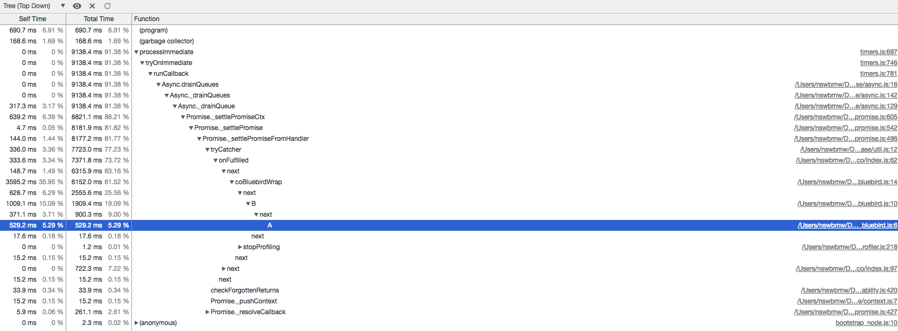

笔者在很长一段时间内都使用 koa@1 +（generator|bluebird）+ sequelize 这个组合，这个组合并没有什么问题，也很常见，但是到了滥用的地步，导致后来维护和调试起来都很痛苦。若排除 sequelize 这个我们不得不用的模块，从调试 cpuprofile 角度讲讲为什么笔者认为应该用 async/await + Promise 替代 co + generator|bluebird。

笔者的观点是：**使用原生模块具有更清晰的调用栈**。

下面用 4 个例子进行对比，看看实现相同逻辑的不同代码生成的 cpuprofile 中调用栈的信息。

**async.js**

```js
const fs = require('fs')
const profiler = require('v8-profiler')

async function A () {
  return await Promise.resolve('A')
}

async function B () {
  return await A()
}

(async function asyncWrap () {
  const start = Date.now()
  profiler.startProfiling()
  while (Date.now() - start < 10000) {
    await B()
  }
  const profile = profiler.stopProfiling()
  profile.export()
    .pipe(fs.createWriteStream('async.cpuprofile'))
    .on('finish', () => {
      profile.delete()
      console.error('async.cpuprofile export success')
    })
})()
```

加载运行后生成的 async.cpuprofile，如下所示：


**可以看出**：asyncWrap 中调用了 B 函数，B 函数调用了 A 函数，A 函数中 resolve 了一个值。在 asyncWrap 中还调用了 stopProfiling 函数。

**co.js**

```js
const fs = require('fs')
const co = require('co')
const profiler = require('v8-profiler')

function * A () {
  return yield Promise.resolve('A')
}

function * B () {
  return yield A()
}

co(function * coWrap () {
  const start = Date.now()
  profiler.startProfiling()
  while (Date.now() - start < 10000) {
    yield B()
  }
  const profile = profiler.stopProfiling()
  profile.export()
    .pipe(fs.createWriteStream('co.cpuprofile'))
    .on('finish', () => {
      profile.delete()
      console.error('co.cpuprofile export success')
    })
})
```

加载运行后生成的 co.cpuprofile，如下所示：


**可以看出**：调用栈非常深，有太多没有用的 co 相关的调用栈。如果 n 个 generator 层层嵌套，就会出现 n 倍的 (anonymous)->onFullfiled->next->toPromise->co->Promise->(anonymous) 调用栈。如果你读过 co 的源码，就可能知道，这是 co 将 generator 解包的过程。其实这个可以通过将 `yield generator` 替换成 `yield* generator` 来优化。

**co_better.js**

```js
const fs = require('fs')
const co = require('co')
const profiler = require('v8-profiler')

function * A () {
  return yield Promise.resolve('A')
}

function * B () {
  return yield * A()
}

co(function * coWrap () {
  const start = Date.now()
  profiler.startProfiling()
  while (Date.now() - start < 10000) {
    yield * B()
  }
  const profile = profiler.stopProfiling()
  profile.export()
    .pipe(fs.createWriteStream('co_better.cpuprofile'))
    .on('finish', () => {
      profile.delete()
      console.error('co_better.cpuprofile export success')
    })
})
```

加载运行后生成的 co_better.cpuprofile，如下所示：


**可以看出**：与 co.js 相比，调用栈清晰了很多，不过与使用 async/await 相比，还是多了些 onFulfilled、next。

**co_bluebird.js**

```js
const fs = require('fs')
const co = require('co')
const Promise = require('bluebird')
const profiler = require('v8-profiler')

function * A () {
  return yield Promise.resolve('A')
}

function * B () {
  return yield * A()
}

co(function * coBluebirdWrap () {
  const start = Date.now()
  profiler.startProfiling()
  while (Date.now() - start < 10000) {
    yield * B()
  }
  const profile = profiler.stopProfiling()
  profile.export()
    .pipe(fs.createWriteStream('co_bluebird.cpuprofile'))
    .on('finish', () => {
      profile.delete()
      console.error('co_bluebird.cpuprofile export success')
    })
})
```

加载运行后生成的 co_bluebird.cpuprofile，如下所示：



**可以看出**：与 co_better.js 相比，调用栈中多了许多 bluebird 模块的无用信息。而且这只是非常简单的示例代码，要是在复杂的业务逻辑中大量使用 bluebird 代码生成的 cpuprofile，就几乎没法看了。

**结论**：使用 async/await + Promise + 命名函数，具有更清晰的调用栈，让分析 cpuprofile 时不再痛苦。

聪明的你可能会问：

1. 为什么不建议用 bluebird？因为：
    1. 随着 V8 不断优化，原生 Promise 性能逐渐提高，bluebird 的性能优势不明显。
    2. 原生 Promise 的 API 足够用，至少能 cover 大部分使用场景，而且还在不断完善，未来还会添加新的 API，例如：Promise.prototype.finally。
    3. 具有更清晰的调用栈。

2. 由于历史遗留原因，现在代码中大量使用了 yield + generator 怎么办？可以：
    1. 将所有 yield generator 替换成 yield * generator。
    2. 升级到 node@8+，逐步用 async/await 替换，毕竟 async 函数调用后返回的也是一个 promise，也是 yieldable 的。
3. 性能比较呢？
    1. node@8+ 下 async/await 完胜 co。

## yield -> yield* 遇到的坑

上面讲到，可以将 yield generator 改成 yield * generator，这里面有一个坑，是由于不明白 co 的原理而滥用 co 导致的。代码如下：

```js
const co = require('co')

function * genFunc () {
  return Promise.resolve('genFunc')
}

co(function * () {
  console.log(yield genFunc()) // => genFunc
  console.log(yield * genFunc()) // => Promise { 'genFunc' }
})
```

**可以看出**：genFunc 这个 generatorFunction 在执行后会返回一个 promise，当使用 `yield genFunc()` 的时候，co 判断返回了一个 promise 会继续帮我们调用它的 then 从而得到真正的字符串。如果使用 `yield * genFunc()`，就用了语言原生的特性而不经过 co，直接返回一个 promise。

**解决方法（任选其一）**：

1. `function * genFunc` -> `function genFunc`，用 `yield genFunc()`。
2. `return Promise.resolve('genFunc')` ->` return yield Promise.resolve('genFunc')`，用 `yield* genFunc()`。

不过，建议最终转换到 async/await + Promise 上来，毕竟 co + generator 只是一个过渡产物。

## Async + Bluebird

如果是使用 async/await + bluebird 的情况呢？代码如下：

**async_bluebird.js**

```js
const fs = require('fs')
const profiler = require('v8-profiler')
const Promise = require('bluebird')

async function A () {
  return await Promise.resolve('A')
}

async function B () {
  return await A()
}

(async function asyncBluebirdWrap () {
  const start = Date.now()
  profiler.startProfiling()
  while (Date.now() - start < 10000) {
    await B()
  }
  const profile = profiler.stopProfiling()
  profile.export()
    .pipe(fs.createWriteStream('async_bluebird.cpuprofile'))
    .on('finish', () => {
      profile.delete()
      console.error('async_bluebird.cpuprofile export success')
    })
})()
```

**结论**：调用栈比 co_blueblird.js 的还乱。

## 参考链接

- [https://medium.com/@markherhold/generators-vs-async-await-performance-806d8375a01a](https://medium.com/%40markherhold/generators-vs-async-await-performance-806d8375a01a)

上一节：[3.1 Promise](https://github.com/nswbmw/node-in-debugging/blob/master/3.1%20Promise.md)

下一节：[3.3 Error Stack](https://github.com/nswbmw/node-in-debugging/blob/master/3.3%20Error%20Stack.md)
