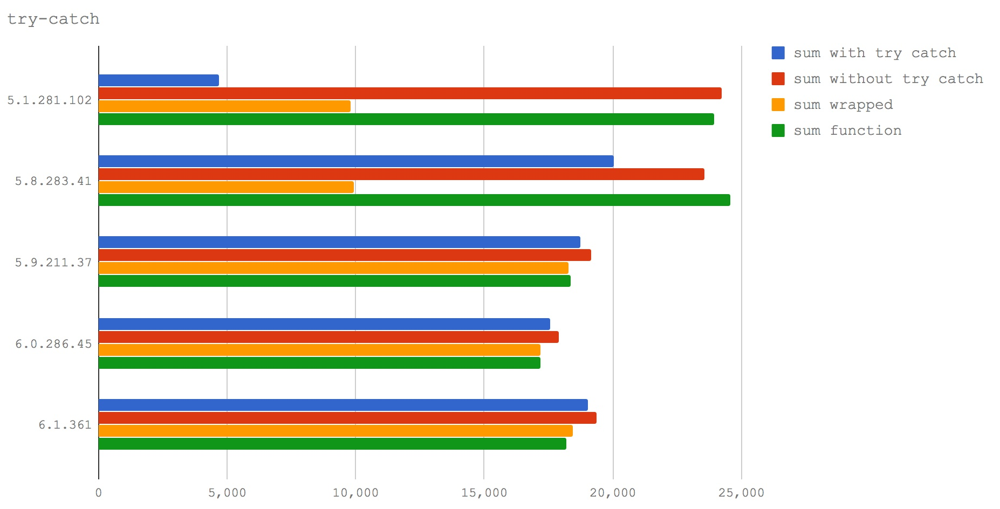
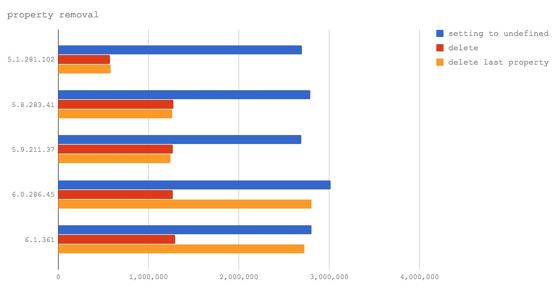
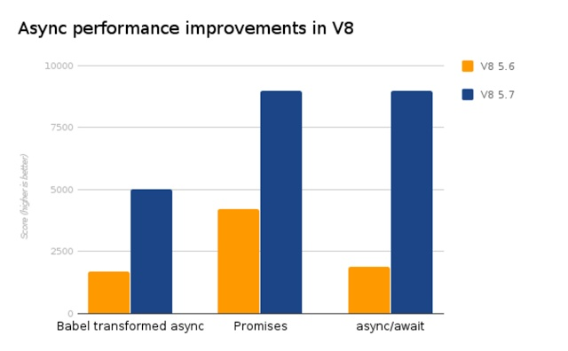

如果你想以最简单的方式提升 node 程序的性能，那就升级到 node@8 吧。这不是一个玩笑，多少 js 前辈们前仆后继以血的教训总结出了一长列『Optimization killers』，口耳相传，典型的比如：

1. try 里面不要写过多代码，V8 无法优化，最好将这些代码放到一个函数里，然后 try 这个函数
2. 少用 delete
3. 少用 arguments
4. ...

然而随着 V8 彻底换上了新的 JIT 编译器—— Turbofan，大多数『Optimization killers』都已经成了过去式。所以在这一小节，我们来扒一扒哪些过去常见的『Optimization killers』已经可以被 V8 优化。

## Turbofan + Ignition

之前 V8 使用的是名为 Crankshaft 的编译器，这个编译器后来逐渐暴露出一些缺点：

1. Doesn’t scale to full, modern JavaScript (try-catch, for-of, generators, async/await, …)
2. Defaults to deoptimization (performance cliffs, deoptimization loops)
3. Graph construction, inlining and optimization all mixed up
4. Tight coupling to fullcodegen / brittle environment tracking
5. Limited optimization potential / limited static analysis (i.e. type propagation)
6. High porting overhead
7. Mixed low-level and high-level semantics of instructions

而引入 Turbofan 的好处是：

1. Full ESnext language support (try-catch/-finally, class literals, eval, generators, async functions, modules, destructuring, etc.)
2. Utilize and propagate (static) type information
3. Separate graph building from optimization / inlining
4. No deoptimization loops / deoptimization only when really beneficial
5. Sane environment tracking (also for lazy deoptimization)
6. Predictable peak performance

Ignition 是 V8 新引入的解释器，用来将代码编译成简洁的字节码，而不是之前的机器码，大大减少了结果代码，减少系统的内存使用。由于字节码较小，所以可以编译全部源代码，而不用避免编译未使用的代码。也就是说，脚本只需要解析一次，而不是像之前的编译过程那样解析多次。

补充一点，之前的 V8 将代码编译成机器码执行，而新的 V8 将代码编译成字节码解释执行，动机是什么呢？可能是：

1. 减轻机器码占用的内存空间，即牺牲时间换空间（主要动机）
2. 提高代码的启动速度
3. 对 V8 的代码进行重构，降低 V8 的代码复杂度

## 版本对应关系

```
node@6       -> V8@5.1 -> Crankshaft
node@8.0-8.2 -> V8@5.8 -> Crankshaft + Turbofan
                V8@5.9 -> Turbofan
node@8.3-8.4 -> V8@6.0 -> Turbofan
```

## try/catch

最著名的去优化之一是使用 『try/catch』代码块。下面用四种场景比较不同 V8 版本下执行的效率：

1. a function with a try/catch in it (sum with try catch)
2. a function without any try/catch (sum without try catch)
3. calling a function within a try block (sum wrapped)
4. simply calling a function, no try/catch involved (sum function)

代码地址：[https://github.com/davidmarkclements/v8-perf/blob/master/bench/try-catch.js](https://github.com/davidmarkclements/v8-perf/blob/master/bench/try-catch.js)



**结论**：node@8.3+，在 try 块内写代码的性能损耗可以忽略不计。

## delete

多年以来，delete 对于任何希望编写高性能 JavaScript 的人来说都是受限制的，我们通常用赋值 undefined 替代。delete 的问题归结为 V8 处理 JavaScript 对象的动态特性和原型链方式，使得属性查找在实现上变得复杂。下面用三种场景比较不同 V8 版本下执行的效率：

1. serializing an object after an object’s property has been set to undefined
2. serializing an object after delete has been used to remove an object’s property which was not the last property added.
3. serializing an object after delete has been used to remove the object’s most recently added property.

代码地址：[https://github.com/davidmarkclements/v8-perf/blob/master/bench/property-removal.js](https://github.com/davidmarkclements/v8-perf/blob/master/bench/property-removal.js)



**结论**：在 node@8+ 中 delete 一个对象上的属性比 node@6 快了一倍，node@8.3+ delete 一个对象上最后一个属性几乎与赋值 undefined 同样快了。

## arguments

我们知道 arguments 是个类数组，所以通常我们要使用 `Array.prototype.slice.call(arguments)` 将它转化成数组再使用，这样会有一定的性能损耗。下面用四种场景比较不同 V8 版本下执行的效率：

1. Exposing the arguments object to another function - no array conversion (leaky arguments)
2. Making a copy of the arguments object using the Array.prototype.slice tricks (Array prototype.slice arguments)
3. Using a for loop and copying each property across (for-loop copy arguments)
4. Using the EcmaScript 2015 spread operator to assign an array of inputs to a reference (spread operator)

代码地址：[https://github.com/davidmarkclements/v8-perf/blob/master/bench/arguments.js](https://github.com/davidmarkclements/v8-perf/blob/master/bench/arguments.js)


**结论**：node@8.3+ 使用对象展开运算符是除了直接使用 arguments 最快的方案，对于 node@8.2- 版本，我们应该使用一个 for 循环将 key 从 arguments 复制到一个新的（预先分配的）数组中。总之，是时候抛弃 Array.prototype.slice.call 了。

## async

V8@5.7 发布后，原生的 async 函数跟 Promise 一样快了，同时 Promise 性能相比 V8@5.6 也快了一倍。如图：



## 不会优化的特性

并不是说上了 Turbofan 就能优化所有的 JavaScript 语法，有些语法 V8 也是不会去优化的（也没有必要），如：

1. debugger
2. eval
3. with

拿 debugger 为例，比较使用和不使用 debugger 时的性能。

代码地址：[https://github.com/davidmarkclements/v8-perf/blob/master/bench/debugger.js](https://github.com/davidmarkclements/v8-perf/blob/master/bench/debugger.js)


**结论**：在所有测试的 V8 版本中，debugger 一直都很慢，所以记得打断点测试完后一定要删掉 debugger。

## 总结

1. 使用最新 LTS 版本的 Node.js
2. 关注 V8 团队的博客——[https://v8project.blogspot.com](https://v8project.blogspot.com/)，了解第一手资讯
3. 清晰的代码远比使用一些奇技淫巧提升一点性能重要得多

## 参考链接

- http://www.infoq.com/cn/news/2016/08/v8-ignition-javascript-inteprete
- <https://docs.google.com/presentation/d/1H1lLsbclvzyOF3IUR05ZUaZcqDxo7_-8f4yJoxdMooU/edit#slide=id.g18ceb14729_0_59>
- [https://www.nearform.com/blog/node-js-is-getting-a-new-v8-with-turbofan/](https://www.nearform.com/blog/node-js-is-getting-a-new-v8-with-turbofan/)
- [https://zhuanlan.zhihu.com/p/26669846](https://zhuanlan.zhihu.com/p/26669846)

上一节：[3.2 Error Stack](https://github.com/nswbmw/node-in-debugging/blob/master/3.2%20Error%20Stack.md)

下一节：[3.4 Rust Addons](https://github.com/nswbmw/node-in-debugging/blob/master/3.4%20Rust%20Addons.md)
