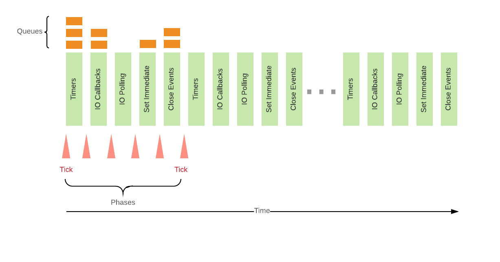

Event Loop 是 Node.js 最核心的概念，所以理解 Event Loop 如何运作对于写出正确的代码和调试是非常重要的。比如考虑以下代码：

```js
setTimeout(() => {
  console.log('hi')
}, 1000)
...
```

我们期望程序运行 1s 后打印出 hi，但是实际情况可能是远大于 1s 后才打印出 hi。这个时候如果理解 Event Loop 就可以轻易发现问题，否则任凭怎么调试都是发现不了问题的。

关于 Event Loop 运作原理这篇文章（[https://cnodejs.org/topic/5a9108d78d6e16e56bb80882](https://cnodejs.org/topic/5a9108d78d6e16e56bb80882)）从 Node.js 和 Libuv 源码分析的非常透彻，本节就不赘述了。本节就拿出六道题来补充一下，放出一张关于 Event Loop 非常直观的图：



绿色小块是 macrotask（宏任务），macrotask 中间的粉红箭头是 microtask（微任务）。

## 3.6.1 题目一

```js
setTimeout(() => {
  console.log('setTimeout')
}, 0)

setImmediate(() => {
  console.log('setImmediate')
})
```

运行结果：

```
setImmediate
setTimeout
```

或者：

```
setTimeout
setImmediate
```

为什么结果不确定呢？

**解释**：setTimeout/setInterval 的第 2 个参数取值范围是：[1, 2^31 - 1]，如果超过这个范围则会初始化为 1，即 setTimeout(fn, 0) === setTimeout(fn, 1)。我们知道 setTimeout 的回调函数在 timer 阶段执行，setImmediate 的回调函数在 check 阶段执行，event loop 的开始会先检查 timer 阶段，但是在开始之前到 timer 阶段会消耗一定时间，所以就会出现两种情况：

1. timer 前的准备时间超过 1ms，满足 loop->time >= 1，则执行 timer 阶段（setTimeout）的回调函数。
2. timer 前的准备时间小于 1ms，则先执行 check 阶段（setImmediate）的回调函数，下一次 event loop 执行 timer 阶段（setTimeout）的回调函数。

再看个例子：

```js
setTimeout(() => {
  console.log('setTimeout')
}, 0)

setImmediate(() => {
  console.log('setImmediate')
})

const start = Date.now()
while (Date.now() - start < 10);
```

运行结果一定是：

```
setTimeout
setImmediate
```

## 3.6.2 题目二

```js
const fs = require('fs')

fs.readFile(__filename, () => {
  setTimeout(() => {
    console.log('setTimeout')
  }, 0)

  setImmediate(() => {
    console.log('setImmediate')
  })
})
```

运行结果：

```
setImmediate
setTimeout
```

**解释**：fs.readFile 的回调函数执行完后：

1. 注册 setTimeout 的回调函数到 timer 阶段。
2. 注册 setImmediate 的回调函数到 check 阶段。
3. event loop 从 pool 阶段出来继续往下一个阶段执行，恰好是 check 阶段，所以 setImmediate 的回调函数先执行。
4. 本次 event loop 结束后，进入下一次 event loop，执行 setTimeout 的回调函数。

所以，在 I/O Callbacks 中注册的 setTimeout 和 setImmediate，永远都是 setImmediate 先执行。

## 3.6.3 题目三

```js
setInterval(() => {
  console.log('setInterval')
}, 100)

process.nextTick(function tick () {
  process.nextTick(tick)
})
```

运行结果：setInterval 永远不会打印出来。

**解释**：process.nextTick 会无限循环，将 event loop 阻塞在 microtask 阶段，导致 event loop 上其他 macrotask 阶段的回调函数没有机会执行。

解决方法通常是用 setImmediate 替代 process.nextTick，如下：

```js
setInterval(() => {
  console.log('setInterval')
}, 100)

setImmediate(function immediate () {
  setImmediate(immediate)
})
```

运行结果：每 100ms 打印一次 setInterval。

**解释**：process.nextTick 内执行 process.nextTick 仍然将 tick 函数注册到当前 microtask 的尾部，所以导致 microtask 永远执行不完； setImmediate 内执行 setImmediate 会将 immediate 函数注册到下一次 event loop 的 check 阶段，而不是当前正在执行的 check 阶段，所以给了 event loop 上其他 macrotask 执行的机会。

再看个例子：

```js
setImmediate(() => {
  console.log('setImmediate1')
  setImmediate(() => {
    console.log('setImmediate2')
  })
  process.nextTick(() => {
    console.log('nextTick')
  })
})

setImmediate(() => {
  console.log('setImmediate3')
})
```

运行结果：

```
setImmediate1
setImmediate3
nextTick
setImmediate2
```

**注意**：并不是说 setImmediate 可以完全替代 process.nextTick，process.nextTick 在特定场景下还是无法被替代的，比如我们就想将一些操作放到最近的 microtask 里执行。

## 3.6.4 题目四

```js
const promise = Promise.resolve()
  .then(() => {
    return promise
  })
promise.catch(console.error)
```

运行结果：

```
TypeError: Chaining cycle detected for promise #<Promise>
    at <anonymous>
    at process._tickCallback (internal/process/next_tick.js:188:7)
    at Function.Module.runMain (module.js:667:11)
    at startup (bootstrap_node.js:187:16)
    at bootstrap_node.js:607:3
```

**解释**：promise.then 类似于 process.nextTick，都会将回调函数注册到 microtask 阶段。上面代码会导致死循环，类似前面提到的：

```js
process.nextTick(function tick () {
  process.nextTick(tick)
})
```

再看个例子：

```js
const promise = Promise.resolve()

promise.then(() => {
  console.log('promise')
})

process.nextTick(() => {
  console.log('nextTick')
})
```

运行结果：

```
nextTick
promise
```

**解释**：promise.then 虽然和 process.nextTick 一样，都将回调函数注册到 microtask，但优先级不一样。process.nextTick 的 microtask queue 总是优先于 promise 的 microtask queue 执行。

## 3.6.5 题目五

```js
setTimeout(() => {
  console.log(1)
}, 0)
new Promise((resolve, reject) => {
  console.log(2)
  for (let i = 0; i < 10000; i++) {
    i === 9999 && resolve()
  }
  console.log(3)
}).then(() => {
  console.log(4)
})
console.log(5)
```

运行结果：

```
2
3
5
4
1
```

**解释**：Promise 构造函数是同步执行的，所以先打印 2、3，然后打印 5，接下来 event loop 进入执行 microtask 阶段，执行 promise.then 的回调函数打印出 4，然后执行下一个 macrotask，恰好是 timer 阶段的 setTimeout 的回调函数，打印出 1。

## 3.6.6 题目六

```js
setImmediate(() => {
  console.log(1)
  setTimeout(() => {
    console.log(2)
  }, 100)
  setImmediate(() => {
    console.log(3)
  })
  process.nextTick(() => {
    console.log(4)
  })
})
process.nextTick(() => {
  console.log(5)
  setTimeout(() => {
    console.log(6)
  }, 100)
  setImmediate(() => {
    console.log(7)
  })
  process.nextTick(() => {
    console.log(8)
  })
})
console.log(9)
```

运行结果：

```
9
5
8
1
7
4
3
6
2
```

process.nextTick、setTimeout 和 setImmediate 的组合，请读者自行推理吧。

## 3.6.7 参考链接

- https://medium.com/the-node-js-collection/what-you-should-know-to-really-understand-the-node-js-event-loop-and-its-metrics-c4907b19da4c
- https://cnodejs.org/topic/57d68794cb6f605d360105bf

上一节：[3.5 Rust Addons](https://github.com/nswbmw/node-in-debugging/blob/master/3.5%20Rust%20Addons.md)

下一节：[4.1 Source Map](https://github.com/nswbmw/node-in-debugging/blob/master/4.1%20Source%20Map.md)
